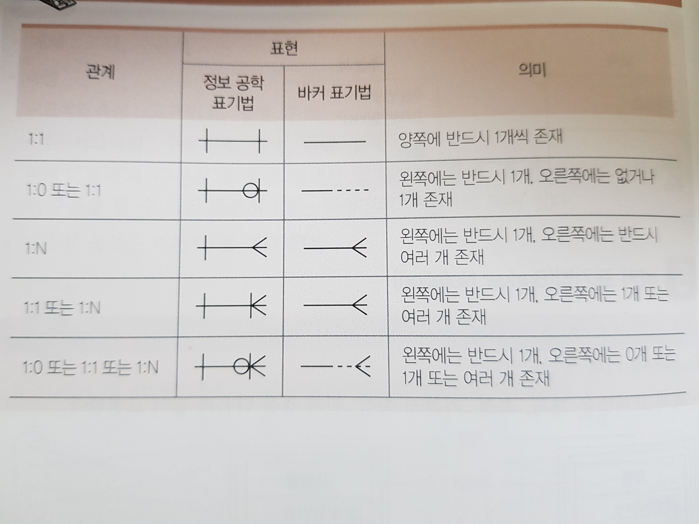

## 076 E-R(개체-관계) 모델

#### E-R(Entity-Relationship, 개체-관계) 모델의 개요

- E-R 모델은 개념적 데이터 모델의 가장 대표적인 것으로, 1976년 피터 첸(Peter Chen)에 의해 제안되고 기본적인 구성 요소가 정립되었다
- E-R 모델은 개체와 개체 간의 관계를 기본 요소로 이용하여 현실 세계의 무질서한 데이터를 개념적인 논리 데이터로 표현하기 위한 방법으로 많이 사용되고 있다
- E-R 모델은 개체 타입(Entity Type)과 이들 간의 관계 타입(Relationship Type)을 이용해 현실 세계를 개념적으로 표현한다
- E-R 모델에서는 데이터를 개체(Entity), 관계(Relationship), 속성(Attribute)으로 묘사한다
- E-R 모델은 특정 DBMS를 고려한 것은 아니다
- E-R 다이어그램으로 표현하며, 1:1, 1:N, N:M 등의 관계 유형을 제한 없이 나타낼 수 있다
- 최초에는 개체, 관계, 속성과 같은 개념들로 구성되었으나 나중에는 일반화 계층 같은 복잡한 개념들이 첨가되어 확장된 모델로 발전했다

### E-R 다이어그램

- E-R 다이어그램은 E-R 모델의 기본 아이디어를 이해하기 쉽게 기호를 사용하여 시각적으로 표현한 그림이다
- E-R 다이어그램은 실체 간의 간의 관계는 물론 조직, 사용자, 프로그램, 데이터 등 시스템 내에서 역할을 가진 모든 실체들을 표현한다
- E-R 다이어그램은 데이터에 대해 개발자, 관리자, 사용자들이 서로 다르게 인식하고 있는 뷰(View)들을 하나로 단일화시킨다
- E-R 다이어그램 표기법에는 피터 첸 표기법, 정보 공학 표기법, 바커 표기법 등이 있다

#### 피터 첸 표기법

- 피터 첸 표기법(Peter Chen Notation)은 1976년 피터 첸이 개발하였다
- 피터 첸 표기법은 개체, 속성, 기본키 속성, 관계 등을 다음과 같이 표현한다
- 

#### 정보 공학 표깁버(Information Engineering Notation)

- 정보 공학 표기법은 1981년에 클리프 핀켈쉬타인(Clive Finkelstein)과 제임스 마틴(James Martin)이 공동 개발하였다
- 정보 공학 표기법은 개체, 속성, 기본키 속성, 관계 등을 표현한다
  - 개체는 사각형 박스로 표시하고 개체명은 박스 바깥쪽 위에 표시한다
  - 속성은 기본키 속성과 일반 속성을 분리하여 표시한다
  - 관계는 관계 표기 기호를 사용하여 표시한다
- 관계 표기 기호
  - | : 필수(Mandatory)
  - O : 선택적(Optional)
  - < : 다중(Multiple)

#### 바커 표기법(Barker Notation)

- 바커 표기법은 영국 컨설팅 회사 CACI에서 개발하였고, 리차드 바커(Richard Barker)에 의해 정립되었다
- 바커 표기법은 개체, 속성, 기본키 속성, 관계 등을 표현한다
  - 개체는 모서리가 둥근 박스로 표시하고 개체명은 박스 안 가장 위에 표시한다
  - 속성은 반드시 값이 저장되어야 하는 경우 *(Mandatory)를 표시하고, 값이 저장될 수도, 안될 수도 있는 경우 O(Optional)을 표시한다
  - 관계는 표기 기호를 사용하여 표시한 후 해당 개체의 역할을 동사적 단어로 입력한다
- 관계 표기 기호
  - 실선 : 필수(Mandatory)
  - 점선 : 선택적(Optional)
  - 꺽쇠(<) : 다중(Multiple)

#### 관계의 표현 및 이해

